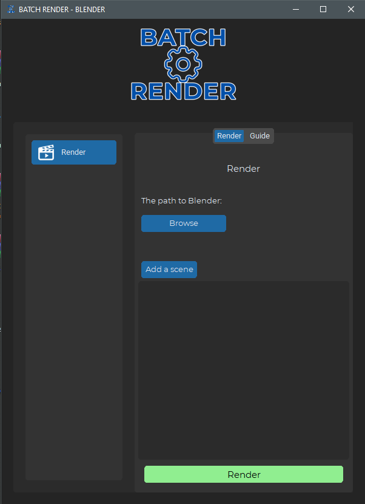
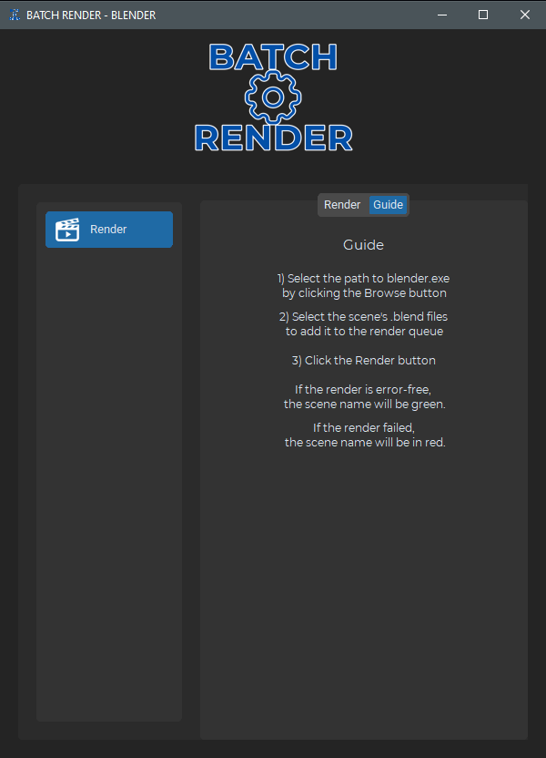

# Batch Render for Blender - Python CustomTkinter Application

Batch Render for Blender is needed to render multiple scenes one by one without using the program interface.


## Features

- Convenient application for rendering
- A guide that will tell you what to do
- Scene name is colored when rendering successfully or failing
- Add and remove scenes
- Manually searching for the folder with blender.exe for different scenes for different versions of Blender

## Installation

### Install app .exe

```bash
  Download last release and start BatchRender.exe
  Antivirus may think that the file is a virus and quarantine it. Pyintaller problem.
```
### Install manually
Clone the project
```bash
  git clone https://github.com/daertious/batch_render_blender.git
```
Install dependencies
```bash
  pip install customtkinter
  pip install pillow 
```
Go to the project directory
```bash
  cd this-project
```

Run the .py file
```bash
  python BatchRender.py
``` 


## Screenshot




